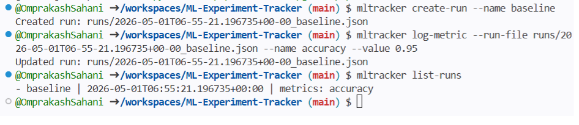

<div align="center">

# ML Experiment Tracker
### A lightweight CLI experiment tracker for learning ML systems, reproducibility, and engineering workflows.

</div>

---

## Overview

A simple command-line tool to create experiment runs, log metrics, and compare results using local JSON storage.

---

## Goal

Build a small system that can:

- Create experiment runs
- Log metrics
- Store experiment metadata
- Compare runs
- Practice production-style GitHub workflow

---

## Why This Project Matters

Experiment tracking is a core part of ML systems.

It helps answer:

- What configuration was used?
- What metrics were produced?
- Which run performed best?
- Can the result be reproduced?

---

## Features

- CLI interface
- Local file-based storage
- Run creation
- Metric logging
- Run listing
- Run comparison
- Tests and CI

---

## Workflow

```text
Issue → Branch → Code → Test → PR → CI → Merge → Release
```

---

## Installation

```bash
pip install -e .
```

---

## Development (optional)

```bash
python -m mltracker.cli
```

---

## Usage

### 1) Create a run

```bash
mltracker create-run --name baseline
```

Example output:

```
Created run: runs/20260430T120000Z_baseline.json
```

---

### 2) Log metrics

```bash
mltracker log-metric --run-file runs/<file>.json --name accuracy --value 0.95
```

Example output:

```
Updated run: runs/20260430T120000Z_baseline.json
```

---

### 3) List runs

```bash
mltracker list-runs
```

Example output:

```
- baseline | 2026-04-30T12:00:00+00:00 | metrics: accuracy, loss
- tuned    | 2026-04-30T12:15:00+00:00 | metrics: accuracy, loss
```

---

### 4) Compare runs

```bash
mltracker compare-runs runs/<file1>.json runs/<file2>.json
```

Example output:

```
- baseline | accuracy=0.95, loss=0.42
- tuned    | accuracy=0.97, loss=0.36
```

Filter by metric:

```bash
mltracker compare-runs runs/<file1>.json runs/<file2>.json --metric accuracy
```

Example output:

```
- baseline | accuracy=0.95
- tuned    | accuracy=0.97
```

### 🎬 CLI Demo



---
